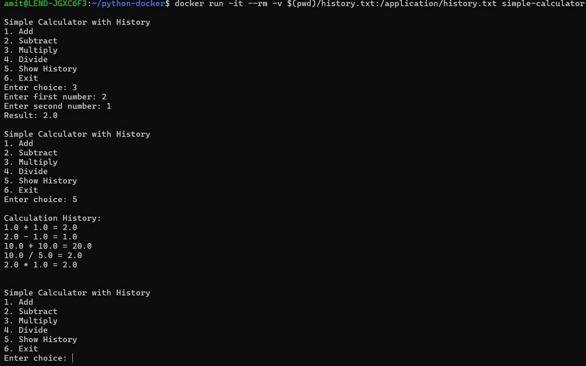

# Simple Calculator with History (Dockerized)

## **Overview**
A simple Python console application that performs basic arithmetic calculations and logs history. It is containerized using Docker for easy deployment.

## **Features**
- Addition, subtraction, multiplication, and division.
- Saves calculation history in `history.txt`.
- Runs in a Docker container for portability.

## **Setup and Usage**

### **1. Clone the Repository**
```
git clone https://github.com/Amit-Maharjan/Docker-Python-Calculator.git
```

### **2. Setup Instructions**
1. Build the Docker image:
   ```
   docker build -t simple-calculator .
   ```
2. Run the container with a mounted volume for persistence:
   ```
   docker run -it --rm -v $(pwd)/history.txt:/application/history.txt simple-calculator

### Screenshots of Application Running
